# 第七章-项目管理

**本章概要**

- 范围管理※※
- 时间管理※※※
- 成本管理※
- 软件质量管理※※※
- 软件配置管理※
- 风险管理※※※

## 一、范围管理

- 产品范围
- 工作范围

### 流程

- 范围计划编制:point_right:范围定义:point_right:创建WBS:point_right:范围确认:point_right:范围控制​

## 二、时间管理

#### 1）流程

- 活动定义:point_right:活动排序:point_right:活动资源**估算**:point_right:活动历时**估算**:point_right:指定进度计划:point_right:进度控制​

#### 2）估算方法

- 专家判断法
- 三点估算法
- 功能点估算法
- 自上而下估算
- 自下而上估算

#### 3）进度控制方法

##### 工期

- 是否为关键活动
- 偏差是否大于总时差
- 偏差是否大于自由时差

##### 解决方案

- 赶工
- 快速跟进

#### 4）概念

##### 总时差（松弛时间）

- 定义：在不延误总工期的前提下，该活动的机动时间
- 研究对象是：单个活动
- 条件是：不延误总工期的前提下
- 计算方法（两种等价、无论是否在关键路径上）：
  - 活动A总时差 = A最迟完成时间 - A最早完成事件
  - 活动A总时差 = A最迟开始时间 - A最早开始事件

##### 自由时差（乐观，计算最早时间）

- 定义：在不影响紧后活动的前提下，该活动的机动时间
- 对于有紧后活动的活动A：A自由时差 = 所有紧后活动最早开始时间 - A最早完成时间
- 对于没有紧后活动的活动A：A自由时差 = 计划工期 - A最早完成时间

##### 若干结论

- 自由时差是总时差的一部分：自由时差≤总时差（总时差为0，自由时差必为0）
- 在图终点的活动：自由时差 = 总时差

### 2.1前导图法（单代号网络图、PDM）

### 2.2关键路径法(Critical Path Method，CPM)

[教你轻松计算AOE(Activity On Edge)网关键路径](https://blog.csdn.net/wang379275614/article/details/13990163)

> - AOV：有向图中，用顶点表示活动，用有向边表示活动之间开始的先后顺序，则称这种有向图为AOV网络；AOV网络可以反应任务完成的先后顺序（拓扑排序）。
>
> - AOE：在AOV网的边上加上权值表示完成该活动所需的时间，则称这样的AOV网为AOE网

**CPM是一种时间管理方法**

- 其中的一种实现方法是AOE网，即下图所示

**说明：**

- 圆圈为：事件
- 实线箭头为：活动
- 虚线箭头：**不耗时但必须的活动**

### 2.3自由时差

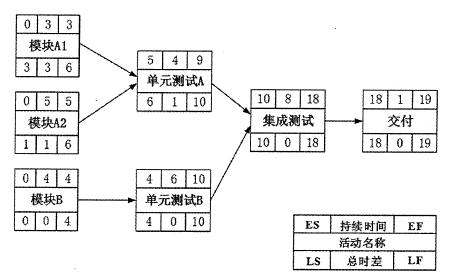

### 2.4甘特图

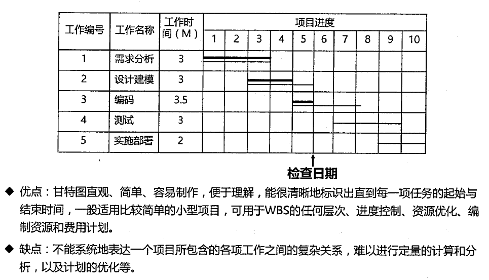

## 三、成本管理

#### 1）流程

- 成本估算:point_right:成本预算:point_right:成本控制​

#### 2）实现方法

##### 成本估算

- 自顶向下估算
- 自底向上估算
- 差别估算法

##### 成本预算

- 直接成本与间接成本
- 管理储备
- 零基准预算

##### 成本控制

- 挣值分析

### 3.1挣值分析

- **把握住：都是以EV（挣值为基准进行比较计算的）**

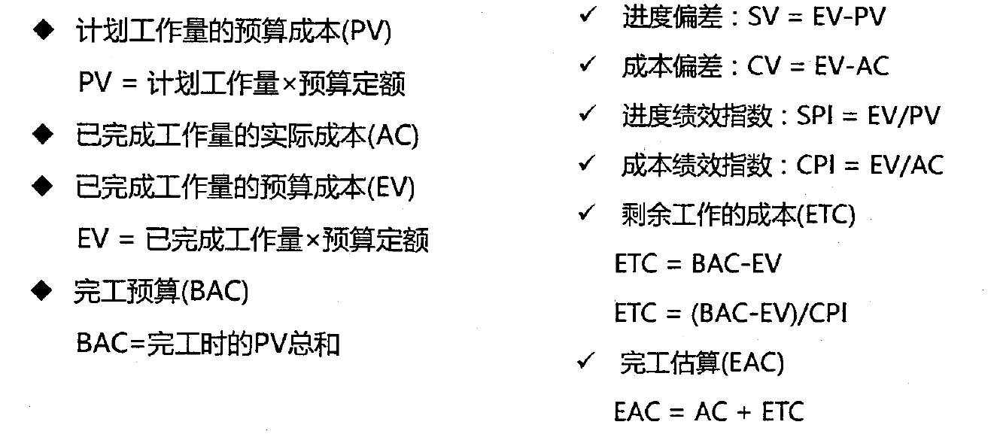

### 3.2挣值曲线

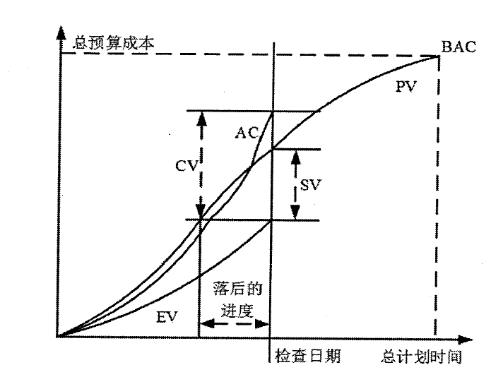

## 四、软件质量管理

### 4.1质量模型

- 质量模型经历了很多版本的迭代
- 下图是GB/T
- [ISO 9126软件质量模型(软件质量模型的6大特性和27个子特性)](https://blog.csdn.net/xifeijian/article/details/8542255)

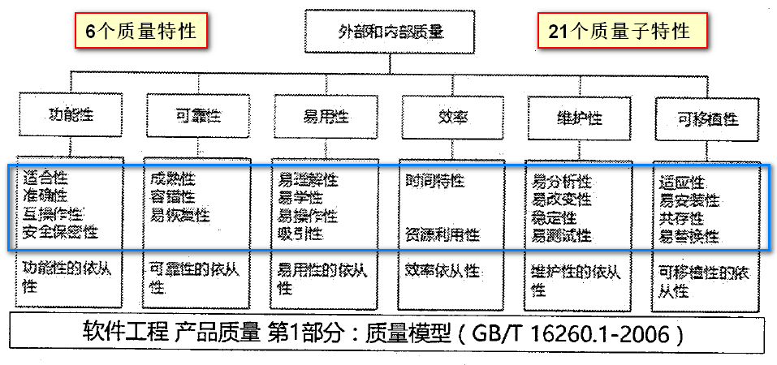

### 4.2质量保证和质量控制

- 实施质量保证是执行过程组的一个过程，而质量控制是监控过程组的一个过程。
- [PMP笔记-区分质量保障（QA）和质量控制（QC）](https://blog.csdn.net/seagal890/article/details/78689977)
- [质量保证、质量控制让你不再傻傻分不清楚](https://zhuanlan.zhihu.com/p/43732189)

### 4.3质量工具

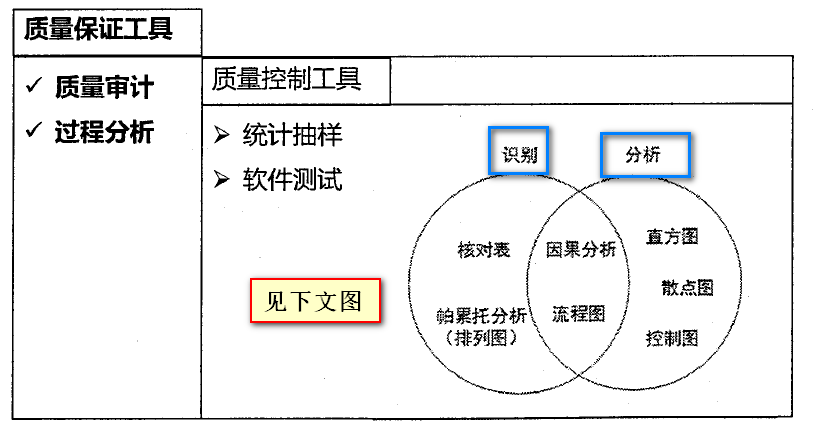

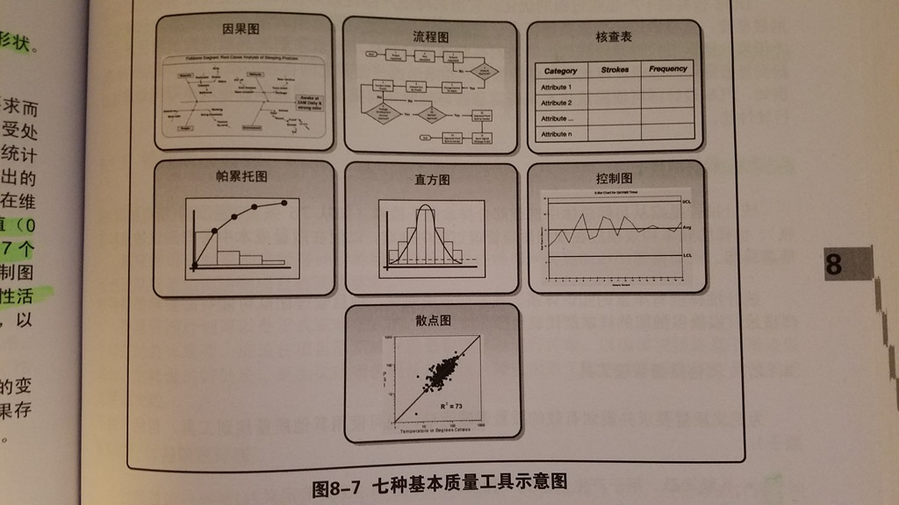

- [工具|质量管理工具大集合](https://zhuanlan.zhihu.com/p/29260036)
  - ISO知识大总结
  - 5W3H思維模式：Why、How、How much、How feel

### 4.4项目管理三角形

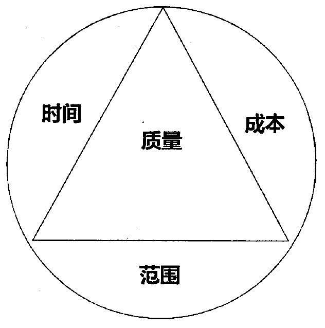

- [项目管理中的神秘三角关系](https://www.jianshu.com/p/16eaafdbce9c)

  - 不能再认同的观点：项目管理实质在于平衡这个三角关系

  - 情景1：客户要增加需求（**基本套路：分析影响、表示同意、但是得价钱和加时间。**）

  - 情景2：客户要压缩进度（**基本套路：分析影响、据理力争、说“不是不可以”，但是“能不能少干点活、能不能加钱”。**）

  - 情景3：客户要削减成本（**基本套路：分析影响、据理力争、说“不是不可以”、但是“能不能少干点活、能不能延长时间”。**）

  - 情景4：客户限定死了范围、时间、成本(**三边限定死的谈判套路：首先要淡定，便显出专业性来，然后谈风险、分析不利的影响、等待时机、谈三角型。**)

    

  - 情景5：三条边限定死，客户不害怕承担风险
  - 情景6：通过关系牌还是搞不定(拖)

## 五、配置项管理

### 5.1配置项

- IEEE对配置项定义：软件、硬件或软硬件兼有的集合
- 可作为配置项管理的有：
  - 外部交付的软件产品和数据
  - 指定的内部软件工作产品和数据
  - 指定的用于创建或支持软件产品的支持工具
  - 供方/供应商提供的软件和客户提供的设备/软件

- 典型配置项（经过评审和检查通过后进入软件配置项管理SCM）包括（**纵向**）：
  - 项目计划书
  - 需求文档
  - 设计文档
  - 源代码
  - 可执行代码
  - 测试用例
  - 运行软件所需的各种数据

- 每个配置项的属性有（**横向**）：
  -  名称、标识符、**文件状态**、**版本**、作者和日期等

- 所有配置项都被保存在**配置库**里，确保不会丢失、混淆
  - 配置项及其历史记录应**能反映软件的演化过程**

### 5.2配置库

此处的基线是：**配置项通过正式评审进入正式受控的一种状态**

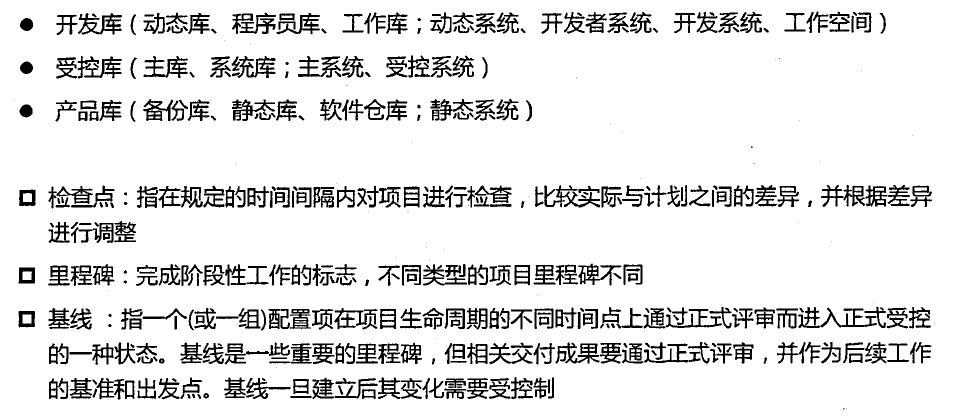

### 5.3变更控制（配置属性之一）

1. 左图是：变更流程
2. 右图（很重要）是：变更状态切换（与5.1的配置项状态联系起来）。也就三种状态
   - 工作状态
   - 评审状态
   - 受控状态

3. 说明：
   - 1.X是第一次提交
   - 2.X是建立基线之后

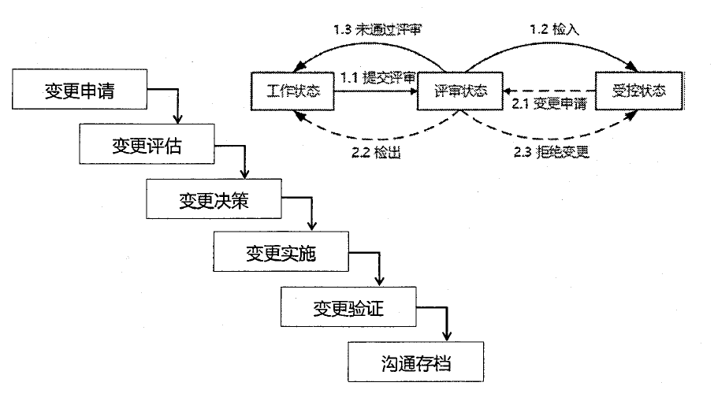

### 5.4版本控制（配置属性之二）

- X.YZ总结

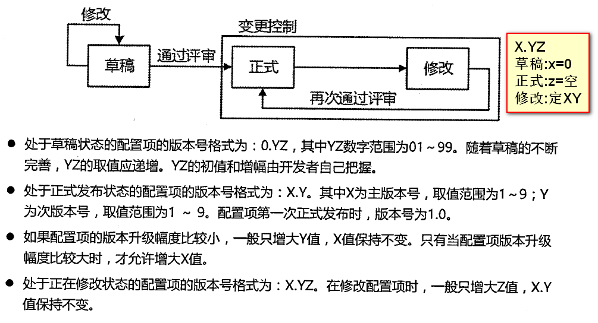

## 六、风险管理

### 6.1风险的概念

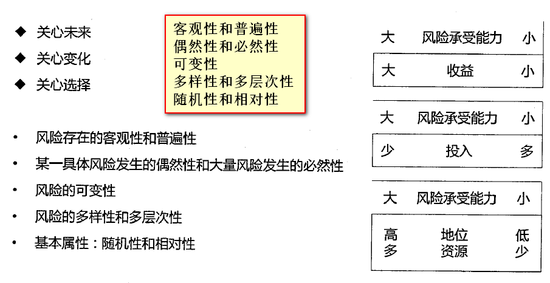

### 6.2风险的分类

#### 1.项目风险

- 潜在的预算、进度、人员和组织、资源、用户和需求问题
- 项目复杂性、规模和结构的不确定性

#### 2.技术风险

- 潜在的设计、实现、接口、测试和维护方面的问题
- 规格说明的多义性、技术上的不确定性、技术陈旧、最新技术（不成熟）

#### 3.商业风险

- 市场风险：市场不需要
- 策略风险：不符合企业的信息系统战略
- 销售风险：销售部门不知如何推销
- 管理风险：领导层不重视
- 预算风险：预算没保证

### 6.3风险曝光度（Risk Exposure）

[风险曝光度](https://www.whitehatsec.com/glossary/content/risk-exposure)

- （风险发生的概率）X（风险发生的总损失）=风险曝光度。

## 七、项目管理工具

