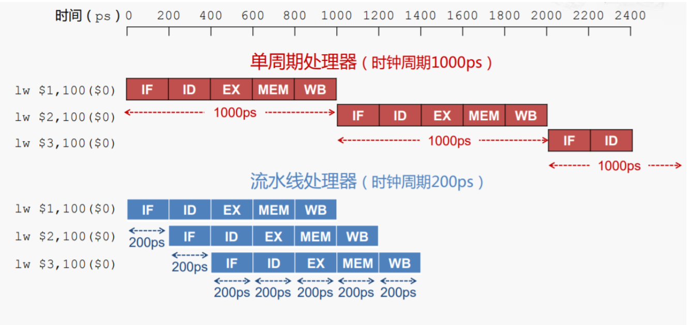

# 第八章 计算机组成与体系结构

> 本章概述
>
> - 编码及浮点数运算 ※※
> - Flynn分类法 ※※
> - CISC与RISC ※※
> - 存储系统 ※※※※※
> - 嵌入式系统 ※※※
> - 系统可靠性计算 ※※

## 一、浮点数运算

### 1.1浮点数定义

> 把小数点左边（即整数）的位宽和小数点右边（即小数）的位宽固定，这就是一个**定点数。**
>
> 如果我愿意把小数部分的位宽分给整数，或者相互分享，比如我可以20位放在整数，12位放小数，在运算过程中，小数点左右的位宽可以一直变换。这就好比小数点在32个bit中浮动，这样的计算就叫**浮点运算。**
>
> - 浮点运算有什么好处呢？对于32位宽来说，它支持最大的数是2^32，支持最小的精度是2^(-32)。这就比定点数的在同样位宽的情况下表达力更强了。

[程序员必知之浮点数运算原理详解](https://blog.csdn.net/tercel_zhang/article/details/52537726)

BiliBili视频：[浮点数的表示与运算-运算](https://www.bilibili.com/video/av50160161/?p=1)

- 表示格式：尾数*基数^指数
- 实例：
  - -5/256转换为：
  - -0.101×2^-101
  - **尾数是二进制表示，指数也是二进制表示**

**加减运算顺序：**

- 真值到机器数的转换
- 对阶：使两个数的阶码相等，小阶向大阶看齐，尾数每右移一位阶码加1
- 尾数加减：位数是二进制数例如59转换为尾数111011
- 规格化：右移或补码
- 舍入
- 溢出判断

## 二、计算机体系结构分类-Flynn分类法

[【整理】SISD、MIMD、SIMD、MISD计算机的体系结构的Flynn分类法](https://blog.csdn.net/conowen/article/details/7256260)

[计算机体系结构](https://www.iambigboss.top/post/25730_1_1.html) 

#### **总结**

- **维度**
  - 指令流
  - 数据流
- **结构**
  - 控制部分数量对应指令流数量
  - 处理器数量对应数据流数量
  - 控制部分、处理器数量对应主存模块数量

##### 1.宏观

- 按处理机的数量分类，分为单处理系统，并行处理与多处理系统和分布式处理系统。

#####  2.微观

- 按并行程度分类，有Flynn分类法，冯泽云分类法，Handler分类法和Kuck分类法。

##### 补充：CPU功能

程序控制：控制程序的执行顺序

操作控制：将操作信号送往对应的部件

时间控制：对操作信号的出现时间、持续时间、出现顺序进行控制

数据处理：对数据进行逻辑运算

中断控制：对异常等作出中断

## 三、CISC与RISC

> RISC(精简指令集计算机)和CISC(复杂指令集计算机)是当前**CPU的两种架构**。它们的区别在于不同的CPU设计理念和方法。
>
> 我们不好去判断它们之间到底谁好谁坏，因为目前他们两种指令集都在蓬勃发展，而且都很成功——X86是复杂指令集（CISC）的代表，而ARM则是精简指令集（RISC）的代表，甚至ARM的名字就直接表明了它的技术：Advanced RISC Machine——高级RISC机。

#### **CISC和RISC的区别**

- 前者更加专注于高性能但同时高功耗的实现（x86），而后者则专注于小尺寸低功耗领域（ARM）。

- 实际上也有很多事情CISC更加合适，而另外一些事情则是RISC更加合适，比如在执行**高密度的运算任务**的时候CISC就更具备优势，而在执行**简单重复劳动的时候RISC**就能占到上风。

## 四、流水线

> **流水线**，亦称**管线**，是现代计算机[处理器](https://zh.wikipedia.org/wiki/处理器)中必不可少的部分，是指将计算机[指令](https://zh.wikipedia.org/wiki/指令)处理过程拆分为多个步骤，并通过多个硬件处理单元并行执行来加快指令执行速度。其具体执行过程类似工厂中的流水线，并因此得名。 
>
> 如果作出类比，则计算机指令就是流水线传送带上的产品，各个硬件处理单元就是流水线旁的工人。

[计算机体系结构——流水线技术（Pipelining）](https://www.cnblogs.com/CorePower/p/CorePower.html)

### 4.1概念

#### MIPS的指令可以分成如下5个阶段：

1. 取指（IF）（Fetch）:：从存储器取指令，并更新PC
2. 译码（ID）（Decode）：指令译码，从寄存器堆读出寄存器的值
3. 执行（EX）（Execute）：运算指令：进行算术逻辑运算，访存指令：计算存储器的地址
4. 访存（MEM）（Memory）：Load指令：从存储器读指令，Store指令：将数据写入寄存器
5. 回写（WB）（Write Back）：将数据写入寄存器堆

#### 单周期与流水线的区别

- 实际上，流水线并不会缩短单条指令的执行时间（甚至会增加时间），而是提高指令的吞吐率（单位时间进多少指令，有多少指令完成）。

### 4.2计算

#### 超标量流水线

#### 吞吐率计算

#### 加速比计算

## 五、层次化存储结构

### 5.1 Cache-概念

#### 局部性原理

#### Cache页面淘汰

#### 主存-编址

#### 磁盘结构与参数

#### 总线

#### 校验码

## 六、系统可靠性分析

### 6.1可靠性指标

### 6.2串联系统与并联系统

### 6.3模冗余系统与混合系统

